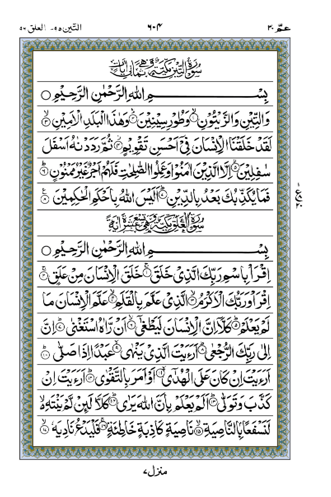
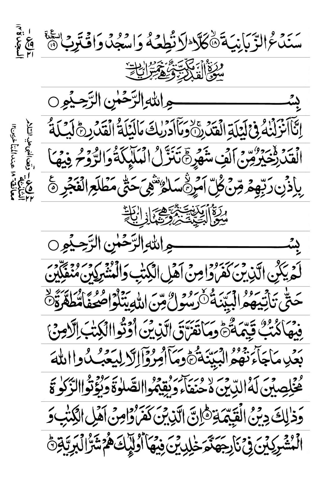

# IndoPak 15-Line Naskh Mushaf – Quran Page Images

A collection of Quran page images based on the **IndoPak 15-Line Naskh Mushaf**.

## Comparison

The following comparison shows the same Quran page in its **original Mushaf form** and in a **clean, standardized version**.

<table>
  <tr>
    <th>Original Mushaf</th>
    <th>Standardized</th>
  </tr>
  <tr>
    <td align="center">
      
    </td>
    <td align="center">
      
    </td>
  </tr>
  <tr>
    <td align="center">
      <i>Original page image from the Mushaf.</i>
    </td>
    <td align="center">
      <i>standardized version without designs</i>
    </td>
  </tr>
</table>

## Contents

### `original_pages`

Contains the original Quran page images from the Mushaf. These images preserve the original visual appearance of the source pages, including their page layout and visual details.

### `standardized_pages`

Contains standardized versions of the Quran pages prepared by **Lucid**. The goal is to provide a clean and consistent representation of the pages without decorative designs or unnecessary visual elements.

## Credits

- **Original page images:** King Fahd Glorious Quran Printing Complex, Medina, Saudi Arabia
- **Standardization:** Lucid

The original Quran page images are credited to the **King Fahad Quran Printing Complex**. The standardized versions were prepared by **Lucid**.

## Purpose

This repository provides both the original page images and standardized versions for **comparison, reference, and use in projects** that require a consistent representation of the IndoPak 15-Line Naskh Mushaf.
